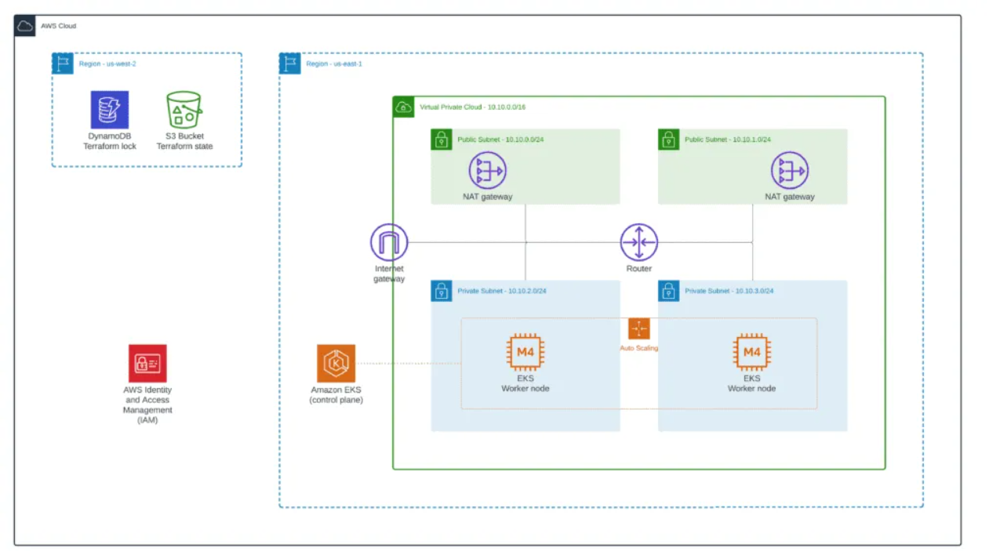

# Terraform for Ticket Selling Microservice App EKS Provisioning

This repository contains Terraform configurations for provisioning an Amazon EKS cluster with supporting infrastructure. The setup is divided into two phases: backend setup and EKS provisioning.

## **Project Structure**

- `tfstate-backend/`  
  Contains the Terraform configuration for setting up an S3 bucket and DynamoDB table to manage remote Terraform state.

- `modules/`  
  Contains the Terraform modules for provisioning the EKS cluster.

---

## **Prerequisites**

1. **Terraform**  
   Install Terraform by following the [official guide](https://www.terraform.io/downloads).

2. **AWS CLI**  
   Configure the AWS CLI with your credentials:
   ```bash
   aws configure
   ```

## Architecture



## Usage

### 1. Backend Setup

```bash
# Clone repository
git clone https://github.com/tdmidas/terraform-ticket-selling.git
cd terraform-ticket-selling

# Set up backend
cd tfstate-backend/example
terraform init
terraform plan
terraform apply
```

### 2.Create Your `tfvars` File

Before running the Terraform configurations, create a `terraform.tfvars` file in the root of your project with the following content:

```hcl
# AWS region
region = "ap-northeast-1"

# VPC configuration
vpc_name = "ticket-selling"
vpc_cidr = "10.0.0.0/16"
azs      = ["ap-northeast-1a", "ap-northeast-1c"]
```

### 3. Deploy EKS

```bash
cd ../../
terraform init
terraform plan
terraform apply --auto-approve
```

### 4. Configure kubectl

```bash
aws eks update-kubeconfig --name cluster-name --region us-west-2
kubectl get nodes
```

